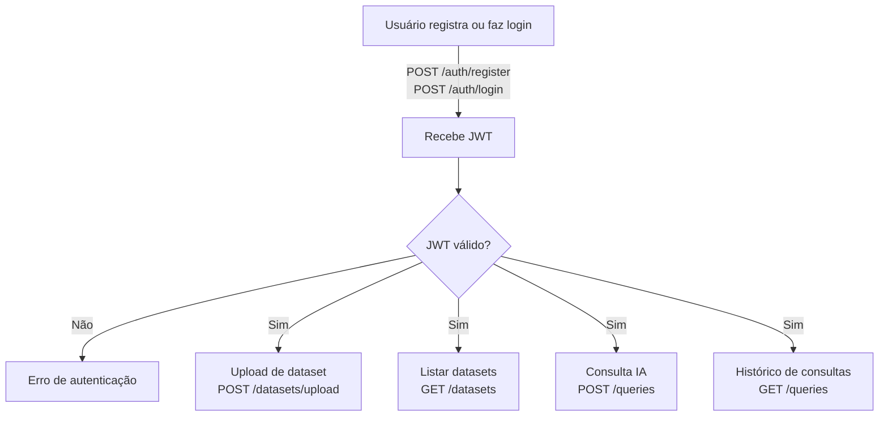

# IA Dataset API

API RESTful para ingestão, gerenciamento e consulta de datasets, com autenticação JWT.

---

## Fluxograma



---

## Tecnologias Utilizadas

- Node.js + Express
- PostgreSQL + Prisma ORM
- JWT para autenticação
- Multer para upload de arquivos
- Docker e Docker Compose
- Swagger UI para documentação

---

## Como Executar

### 1. Clone o repositório

```sh
git clone https://github.com/seu-usuario/ia-dataset-api.git
cd ia-dataset-api
```

### 2. Configure as variáveis de ambiente

Edite o arquivo `.env` conforme exemplo:

```
PORT=3000
DATABASE_URL=postgresql://postgres:postgres@db:5432/iadataset
JWT_SECRET_KEY=sua_chave_secreta
JWT_EXPIRE_IN=1h
BCRYPT_SALT=10
```

### 3. Suba os containers com Docker Compose

```sh
docker-compose up --build
```

### 4. Acesse a documentação Swagger

Abra [http://localhost:3000/api-docs](http://localhost:3000/api-docs) no navegador para visualizar e testar os endpoints.

---

## Principais Endpoints

- **POST /auth/register**  
  Cadastro de usuário (nome, email, senha)

- **POST /auth/login**  
  Login do usuário (email, senha)

- **GET /auth/me**  
  Retorna dados do usuário autenticado (necessário JWT)

- **POST /datasets/upload**  
  Upload de arquivo `.csv` ou `.pdf` (necessário JWT)

- **GET /datasets**  
  Lista datasets do usuário autenticado (necessário JWT)

- **GET /queries**  
  Lista histórico de buscas simuladas via IA (necessário JWT)

- **POST /queries**  
  Registra uma busca simulada via IA (necessário JWT)

---

## Testando a API

Você pode testar todos os endpoints diretamente pela interface Swagger em `/api-docs`.

---

## Observações

- O banco de dados é inicializado automaticamente via Docker Compose.
- Os arquivos enviados são processados e os metadados armazenados no banco.
- O JWT deve ser enviado no header `Authorization: Bearer <token>` para rotas protegidas.

---
